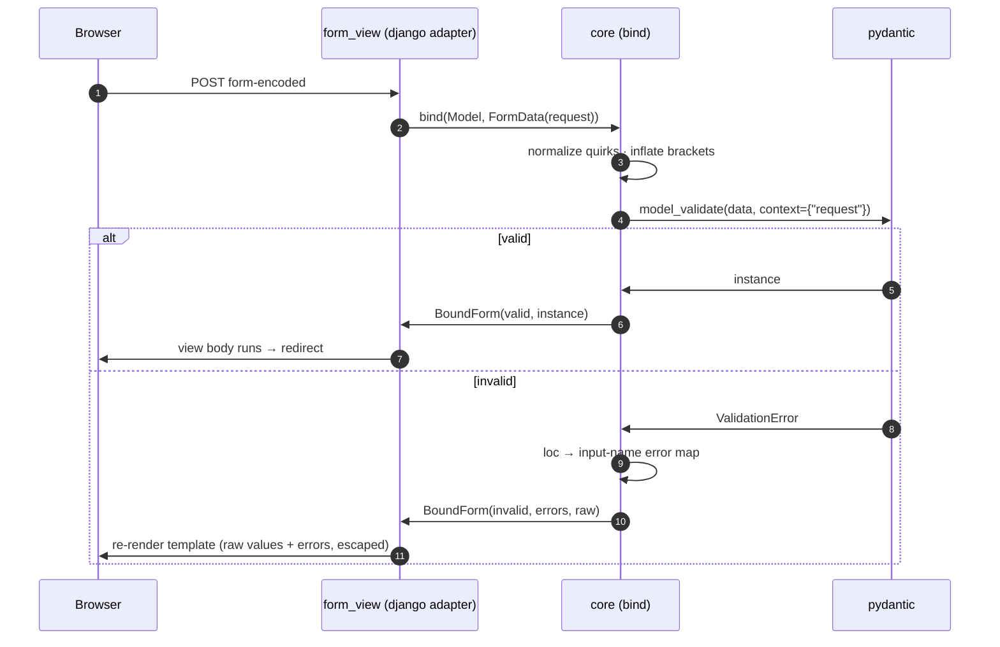

# formidant — design & plan

**Status: plan locked 2026-07-22 with mjo.** All three phases CLOSED — acceptance criteria,
test design (PR #1), and build design (decisions, module map, flow, ticket plan) accepted.
**In build — ticket 1 (scaffolding) in progress; nothing merged yet.** All work lands via
PR — no direct commits to main (mjo, 2026-07-22). This doc carries the working design
between sessions; update Implementation status as tickets land.
This doc pioneers the acceptance-criteria and test-design sections; once proved out here they
get backported to `~/.claude/design-doc-reference.md` (agreed 2026-07-22 — prove out first,
then amend the standard). This repo is standalone; the README will grow into the canonical
record if the project sprouts subsystems.

## Implementation status (updated 2026-07-23)

Design pass complete and locked (2026-07-22). Ticket 1 (scaffolding) merged. Tickets 2–4
(binding core: protocol/flatten/bind/BoundForm) done on PR seam B, in review. Next: PR seam
C (rendering — tickets 5–7). Findings so far worth knowing: pydantic natively coerces
checkbox "on" → True; SecretStr treats "" as absent (empty password = missing, by
construction); pydantic hooks must attach to protocols after class creation or they become
protocol members and break structural isinstance.

## Context

**formidant is a Pydantic-based web form system: binding + validation + bound-form lifecycle +
server-side HTML rendering.** It exists because the quadrant is empty: nobody ships pydantic
validation with a server-side renderer and a bound re-render story (ecosystem survey,
2026-07-22 — see Key references). Django Forms owns that lifecycle but with a widget/Form API
mjo actively wants to leave; django-ninja proves the clean pydantic binding pattern
(parse → flat dict → inflate → `model_validate`) but is API-only, has no renderer, and its
binding is baked into the framework.

Shape of the build (from the 2026-07-22 research pass, to be confirmed as Decisions in phase 3):

- **Django-first, framework-agnostic core.** The core binds from a small multidict protocol,
  never a Django request; a thin Django adapter feeds it. Flask/Litestar adapters are possible
  later but not designed for now beyond keeping the seam clean.
  **Review addition (mjo, 2026-07-22):** adapter authoring must be a *public, documented
  surface* so third parties can build adapters out-of-tree — formidant must never be passed
  up because integration is hard (→ P4). The DX north star is django-ninja's multi-source
  signature binding (path + query + `Form[Item]` co-declared in one view signature),
  approached "as close as we possibly can" per adapter (→ D4).
- **Three pieces:** (1) binding core — django-ninja's flatten/inflate + error shaping as the
  starting point (MIT), extended with bracket-notation nesting; (2) bound-form wrapper — the
  raw-data + per-field-errors + re-render object (no good prior art; the core design problem);
  (3) renderer — type→widget mapping via `Annotated` metadata, template-based, htmx-friendly.

**Rejected framings** (mjo, 2026-07-22):

- *JSON-Schema → client-side renderer (RJSF path)* — mature but requires a React pipeline and
  duplicates validation client-side; the whole point is server-side rendering for htmx/SSR apps.
- *Django-Forms feature parity* — formsets, ModelForm/ORM introspection, widget media, i18n are
  a drowning-depth long tail. formidant targets hand-defined schemas; list-of-nested-model
  editing over htmx replaces formsets; ModelForm is explicitly out of scope.
- *Framework-agnostic-first* — designing Flask/Litestar adapters on day one is speculative
  flexibility. The protocol seam keeps the door open at near-zero cost; that is enough.

## Acceptance criteria — ACCEPTED (mjo, 2026-07-22) except items marked DRAFT

What "done and correct" means for v1. Each criterion is stated so a test or demo step can be
pointed at it; the Test design section (phase 2) maps test cases to these IDs. Grouped:
**B** binding, **L** lifecycle, **R** rendering, **P** portability, **X** security/correctness,
**D** developer experience. Non-goals are listed after the criteria and are as binding as the
criteria themselves.

### B — Binding & validation

- **B1 — Vanilla pydantic models bind.** Any plain `pydantic.BaseModel` (v2) binds from
  form-encoded data to a validated instance with stock pydantic coercion, constraints, and
  defaults. No formidant base class, mixin, or model_config required.
- **B2 — Bracket-notation nesting.** `address[city]` binds to nested models and
  `items[0][name]` binds to `list[Model]` fields — a strict superset of django-ninja, which
  supports neither (leaf-name nesting only, no lists of nested objects).
- **B3 — Scalar lists via repeated keys.** `tags=a&tags=b` binds to `list[str]` (multi-select /
  checkbox-group encoding).
- **B4 — HTML form quirks are normalized by default.** Unchecked checkbox (absent key) → False
  or field default for `bool` fields; empty string → `None`/default for Optional and
  non-string fields. No user-defined annotated types needed (django-ninja punts this to a
  documented user recipe; formidant does not).
- **B5 — File uploads bind** to a declared file field type through the same pipeline.

### L — Bound-form lifecycle

- **L1 — One bind call, two inspectable outcomes.** Binding submitted data yields a bound form
  object: on valid input it exposes the typed pydantic instance; on invalid input it exposes
  per-field errors (keyed by field path, mapped from pydantic `loc`) and the raw submitted
  values. No exception-catching in user view code.
- **L2 — Raw input survives re-render.** An invalid bound form re-renders with the user's raw
  input preserved verbatim — including values that failed coercion (e.g. `"abc"` typed into an
  int field re-renders as `"abc"`, not blank, not `0`).
- **L3 — Errors render in place.** Field errors render adjacent to their field; model-level
  errors (`model_validator`) render at form level. Nested/list field errors attach to the
  specific nested input they belong to.
- **L4 — Unbound render with initial values.** A form renders unbound from the model class
  alone (defaults populate inputs) and from an existing model instance (edit-form case).
- **L5 — ACCEPTED (mjo, 2026-07-22) — Valid-only view style.** Views can opt
  into receiving only valid, typed form instances: the adapter intercepts GET (unbound render)
  and invalid POST (re-render with errors) so the view body never contains an
  `if form.is_valid` branch. Response policy on invalid input belongs to the **adapter**, not
  the core: the Django HTML adapter re-renders the template with the bound form; an API-style
  adapter is free to raise/return its framework's 4xx instead (django-ninja returns 422). The
  core stays exception-free and only ever reports the L1 outcome. The low-level bind-and-branch
  API (L1) remains available as the escape hatch. Prior art: django-ninja/FastAPI
  (validate-before-handler), Django's own `FormView.form_valid()` hook (branch-free user code
  via inversion of control).
- **L6 — ACCEPTED (mjo, 2026-07-22) — Escape hatches around the automatic
  invalid response.** Two mechanisms, solving two different cases:
  1. **`on_invalid` hook** — a callback (per-view, with an adapter-level default) invoked
     between validation failure and the automatic response; it may return its own response or
     defer to the default. Covers logging/metrics/alternate responses without hacking into
     the request cycle.
  2. **Annotation-declared contract** — `form: SignupForm` means valid-only (short-circuit on
     invalid, the L5 default); `form: Bound[SignupForm]` means the body always runs and
     receives the L1 bound-form object, invalid included, restoring manual branching with
     decorator ergonomics. What enters the view is exactly what the signature declares.

### R — Rendering

- **R1 — Full default widget matrix.** Every v1-supported field type renders a sensible
  default widget with zero configuration. v1 matrix: `str`→text, `bool`→checkbox,
  `int`/`float`/`Decimal`→number, `date`/`datetime`/`time`→native date/datetime-local/time
  inputs, `EmailStr`→email, `SecretStr`→password, `HttpUrl`→url, `UUID`→text,
  `StrEnum`/`Literal`→select, `Optional[T]`→T's widget non-required, `list[scalar]`→
  checkbox group or multi-select, nested `BaseModel`→fieldset, `list[BaseModel]`→repeatable
  group with add/remove, file field→file input. Constraints flow to attributes:
  `max_length`→`maxlength`, `ge`/`le`→`min`/`max`, required→`required`.
- **R2 — Presentation via `Annotated`, orthogonal to validation.** Widget choice, label, help
  text, placeholder, and arbitrary HTML attrs are overridable per field through `Annotated`
  metadata that has zero effect on the model's validation or serialization behavior.
- **R3 — Template-overridable output.** Default rendering ships as templates users can
  override at the form, fieldset, and widget level (the crispy-forms seam, not Python
  string-building the user can't touch). **Review note (mjo, 2026-07-22):** default templates
  are deliberately minimal — extremely simple, clean markup; Django's default rendering does
  too much and is the anti-pattern here.
- **R4 — htmx-friendly partials.** A single field (widget + errors) can be rendered in
  isolation, so hx-swap of one field or one list row works without re-rendering the form.
- **R5 — Round-trip fidelity.** For any v1-matrix model instance: render → submit the rendered
  inputs' values unchanged → binds valid and equals the original instance.
- **R6 — ACCEPTED (mjo, 2026-07-22) — Render parity between core and adapter
  sugar.** Rendering lives in the framework-free core (`form.render()`,
  `render_field(form, "email")` — names illustrative); `` /
  `` are thin Django template tags delegating to it. Byte-identical
  output, proven by a test comparing tag output to core output. Engine: Jinja2 behind a
  narrow seam — see Decisions.

### P — Portability

- **P1 — Core imports no Django.** `import formidant.core` (binding, lifecycle, widget
  resolution) succeeds and pulls in no `django.*` module. Enforced by a test, not convention.
- **P2 — All request access goes through one protocol.** The core consumes a defined
  `FormData` protocol (multidict with `getlist` + files mapping); the Django adapter is the
  only place `request.POST`/`request.FILES` appear.
- **P3 — The Django adapter is thin.** Adapter + CSRF/template integration ≤ ~150 lines of
  non-test code. If it trends past that, the seam is wrong — stop and redesign.
- **P4 — ACCEPTED (mjo, 2026-07-22) — Adapters are buildable out-of-tree.** The
  adapter-authoring surface (the `FormData` protocol, signature-introspection entry points,
  and error-shape contract) is public and documented; a third-party adapter imports nothing
  underscore-prefixed. Measured by: our own Django adapter uses only that public surface.

### X — Security & correctness

- **X1 — No XSS through re-render.** Raw user input containing HTML/script is escaped in all
  re-render paths (values, error messages, attrs). Proven by test with hostile input.
- **X2 — CSRF present by default in Django.** The Django-adapter form rendering includes the
  CSRF token without the user asking; the core exposes a slot mechanism so other adapters can
  do the same.
- **X3 — Out-of-schema keys are ignored, never bound.** Extra POST keys cannot inject fields
  (mass-assignment posture; pydantic `extra="forbid"` models surface it as a form error, not a
  500).

### D — Developer experience (the "is it actually nicer than Django Forms" measures)

- **D1 — The canonical example fits on a screen.** A signup form (email, password, display
  name, TOS checkbox) — schema + view with validate/re-render/redirect + template include —
  in ≤ 25 lines of user-written Python and ≤ 5 lines of template, imports excluded.
- **D2 — One schema, three consumers.** The same pydantic model works unmodified as: a
  formidant form, a django-ninja request body, and a plain serialization schema. No dual
  definitions (the Personalkollen drift problem is the failure mode this kills).
- **D3 — Errors are human-readable by default.** Default pydantic v2 messages render as-is and
  are acceptable; a per-field override hook exists for custom wording. (Full i18n: deferred.)
- **D4 — ACCEPTED (mjo, 2026-07-22) — Ninja-style multi-source binding in the
  Django adapter.** A decorated plain Django view can co-declare path, query, and form
  parameters in one signature (`def update(request, item_id: int, q: str, item: Form[Item])`)
  and each is bound from its source — the django-ninja DX on vanilla Django views. This rides
  the same introspection core we port anyway; it is the flagship demo of P4's adapter surface.

### Non-goals for v1 (binding)

- **No ModelForm equivalent** — no ORM introspection, no `save()`.
- **No formsets** — `list[BaseModel]` + htmx row add/remove is the replacement.
- **No client-side validation or JS shipped** — htmx attributes in templates at most.
- **No i18n of messages** — deferred round.
- **No async binding path** — deferred until an async adapter exists to need it.

## Worked example — ACCEPTED with the three-piece architecture (mjo, 2026-07-22)

Illustrative only: API names are OPEN until phase 3; the *shape* is what's being approved.

**In plain terms:** you write one plain pydantic model. Piece 1 turns a browser's
form-encoded POST into that model via pydantic validation. Piece 2 wraps the outcome in a
bound-form object (or keeps invalid submissions out of your view entirely). Piece 3 renders
the model class — or a failed submission with its errors — as minimal HTML from overridable
templates. The same model works unmodified in django-ninja or anywhere else pydantic goes.

### The schema — plain pydantic, presentation via `Annotated` (input to all three pieces)

```python
class SignupForm(BaseModel):
    email: EmailStr
    display_name: Annotated[str, Meta(label="Display name", placeholder="How you'll appear")]
    password: SecretStr
    accept_tos: Annotated[bool, Meta(label="I accept the terms of service")]

    @field_validator("password")
    @classmethod
    def password_min_length(cls, v: SecretStr) -> SecretStr:
        if len(v.get_secret_value()) < MIN_PASSWORD_LENGTH:
            raise ValueError(f"Password must be at least {MIN_PASSWORD_LENGTH} characters")
        return v
```

`Meta` is presentation-only metadata: pydantic ignores it, so validation/serialization are
untouched (R2) and the model stays usable as a ninja body (D2).

### Piece 1 — binding core (framework-free)

What the wire carries vs. what pydantic sees, for a nested example:

```
POST name=Ada&address[city]=Oslo&items[0][sku]=A1&items[0][qty]=2&tags=red&tags=blue

→ inflate →  {"name": "Ada", "address": {"city": "Oslo"},
              "items": [{"sku": "A1", "qty": "2"}], "tags": ["red", "blue"]}

→ Order.model_validate(...)   # stock pydantic does coercion/constraints/defaults
```

The core consumes any multidict via the `FormData` protocol — it never sees a Django request.

### Piece 2 — bound form, low-level style (L1: one call, branch once, no exceptions)

```python
def signup(request: HttpRequest) -> HttpResponse:
    form = bind(SignupForm, request)
    if form.valid:
        create_account(form.instance)          # form.instance is a typed SignupForm
        return redirect("welcome")
    return render(request, "signup.html", {"form": form})
```

`bind` is method-aware: GET yields an unbound form (defaults populate, `valid` is False), a
POST binds and validates. One branch covers first render, success, and re-render-with-errors.

### Piece 2 — valid-only style (L5: the branch disappears)

```python
@form_view(template="signup.html")
def signup(request: HttpRequest, form: SignupForm) -> HttpResponse:
    create_account(form)                       # body only runs on valid POST
    return redirect("welcome")
```

GET and invalid POST never enter the body — the adapter renders the template with the
(un)bound form in context. `form` is the pydantic instance itself, fully typed.

### Piece 3 — renderer

```django
<form method="post">
  
  <button>Sign up</button>
</form>
```

What the default template emits for one field after a failed submit (minimal by design; raw
input preserved per L2, escaped per X1):

```html
<div class="fd-field fd-invalid">
  <label for="id_email">Email</label>
  <input type="email" name="email" id="id_email" value="ada@" required>
  <p class="fd-error">value is not a valid email address</p>
</div>
```

`` renders one field for htmx partial swaps (R4).

### The north star — ninja-style multi-source binding on a vanilla Django view (D4)

```python
@bind_view
def update_item(request: HttpRequest, item_id: int, q: str, item: Form[Item]) -> HttpResponse:
    ...
```

`item_id` binds from the URLconf kwarg, `q` from the query string, `item` from POST — the
django-ninja signature experience without django-ninja. Third-party adapters build the same
thing for their framework from the public P4 surface (protocol + introspection + error shape).

## Test design — ACCEPTED (mjo, 2026-07-22)

The vetting suite, designed before build. Rules: every criterion is claimed by at least one
named test (or explicitly marked review-gate); tests mirror the source tree (spoe-forge
pattern) plus a dedicated round-trip suite and an end-to-end demo app standing in for
spoe-forge's real-HAProxy docker harness. Module names presume the phase-3 layout
(`formidant/core/` + `formidant/django/`) and shift with it if needed; the *mapping* is what
gets locked here.

### Suite layout

```
tests/
  core/
    test_flatten.py       bracket-key parsing → nested dict (pure, no pydantic)
    test_binding.py       multidict → validated instance (B1, B3, B4, B5)
    test_nesting.py       nested models + list[Model] (B2)
    test_bound_form.py    bound-form object semantics (L1, L2, L4)
    test_widgets.py       type→widget resolution + Meta metadata (R1, R2, D3)
    test_render.py        emitted HTML, overrides, partials, escaping (L3, R3, R4, X1)
    test_roundtrip.py     hypothesis property suite (R5)
    test_boundaries.py    import/api-surface meta-tests (P1, P4)
  django/
    test_bind.py          method-aware bind over real HttpRequest (adapter L1/L4, B5 uploads)
    test_form_view.py     valid-only views + escape hatches (L5, L6)
    test_bind_view.py     multi-source signature binding (D4)
    test_template_tags.py tag↔core parity, CSRF injection (R6, X2)
    test_security.py      mass-assignment, hostile input through the full stack (X3, X1)
    test_interop.py       same schema as ninja body + JSON schema (D2)
  demo/
    test_demo_app.py      end-to-end via Django test client against the demo app (D1)
```

The **demo app** (`demo/` in-repo: minimal Django project with the signup form and an
htmx list-of-nested-models page) is a real running artifact, not test scaffolding — it is
the canon for D1 and the manual-QA surface, mirroring spoe-forge's `docker/` harness.

### Criterion → test mapping

| ID | Proven by | Shape |
|---|---|---|
| B1 | `core/test_binding.py::test_vanilla_model_binds` + coercion/constraint/default param cases | table-driven unit |
| B2 | `core/test_nesting.py` — nested model, `list[Model]`, deep mix, malformed-bracket error cases | unit |
| B3 | `core/test_binding.py::test_repeated_keys_bind_list` | unit |
| B4 | `core/test_binding.py::test_form_quirk_normalization` — absent checkbox / empty string × (bool, Optional[T], defaulted, required) matrix | table-driven unit |
| B5 | `core/test_binding.py` (protocol fake) + `django/test_bind.py::test_file_upload` (real `SimpleUploadedFile`) | unit + adapter |
| L1 | `core/test_bound_form.py::test_valid_exposes_instance`, `::test_invalid_exposes_errors_and_raw` — asserts no exception escapes | unit |
| L2 | `core/test_bound_form.py::test_raw_survives_failed_coercion` + `core/test_render.py::test_rerender_shows_raw_input` | unit + render |
| L3 | `core/test_render.py::test_field_error_placement`, `::test_model_error_at_form_level`, `::test_nested_list_error_targets_row` | render |
| L4 | `core/test_bound_form.py::test_unbound_from_class` (defaults), `::test_unbound_from_instance` (edit case) | unit |
| L5 | `django/test_form_view.py::test_get_renders_unbound`, `::test_invalid_post_rerenders`, `::test_valid_post_enters_body` | adapter (RequestFactory) |
| L6 | `django/test_form_view.py::test_on_invalid_hook_overrides_response`, `::test_on_invalid_hook_defers`, `::test_bound_annotation_always_enters_body` | adapter |
| R1 | `core/test_widgets.py::test_default_widget_matrix` — one row per v1 type, asserting input type + constraint attrs (`maxlength`, `min`/`max`, `required`) | table-driven unit |
| R2 | `core/test_widgets.py::test_meta_overrides` + `::test_meta_is_validation_inert` (model validates/serializes/json-schemas identically with Meta stripped) | unit |
| R3 | `core/test_render.py::test_override_widget_template`, `::test_override_fieldset`, `::test_override_form` (user loader dir wins) | render |
| R4 | `core/test_render.py::test_render_field_partial_matches_field_block` | render |
| R5 | `core/test_roundtrip.py` — hypothesis: generate instances over the v1 matrix, render, harvest input values with an html.parser helper, rebind, assert equality | property |
| R6 | `django/test_template_tags.py::test_tag_output_identical_to_core_render` (byte compare, form + single field) | adapter |
| P1 | `core/test_boundaries.py::test_core_imports_no_django` — subprocess `import formidant.core`, assert no `django*` in `sys.modules` | meta |
| P2 | P1 + typed `FormData` protocol as the only bind input; residual enforcement is a phase-3 review gate | meta + review-gate |
| P3 | review-gate at each adapter PR (line counting in CI is brittle; the ~150 ceiling is a design tripwire, not a build gate) | review-gate |
| P4 | `core/test_boundaries.py::test_django_adapter_uses_public_surface_only` — ast walk of `formidant/django/` asserting no underscore-prefixed imports from core | meta |
| X1 | `core/test_render.py::test_hostile_input_escaped` — `<script>`, quote-breaking attrs, hostile error text, in value/attr/error positions; repeated through the full stack in `django/test_security.py` | render + adapter |
| X2 | `django/test_template_tags.py::test_csrf_token_rendered` | adapter |
| X3 | `django/test_security.py::test_extra_keys_ignored`, `::test_extra_forbid_is_form_error_not_500` | adapter |
| D1 | `demo/test_demo_app.py::test_signup_example_line_budget` — counts non-blank, non-import lines of the demo signup module (≤ 25) | meta over real demo code |
| D2 | `django/test_interop.py::test_same_schema_as_ninja_body` (django-ninja as test-only dep), `::test_json_schema_emits` | integration |
| D3 | `core/test_render.py::test_default_messages_render`, `core/test_widgets.py::test_message_override_hook` | unit |
| D4 | `django/test_bind_view.py::test_path_query_form_bind_together`, `::test_source_errors_report_per_source` | adapter |

Flagged as **not a standard pattern**: the two meta-tests that count/inspect source (D1 line
budget, P4 ast walk). Research verdict: no established library does this; the standard
alternative is review-gating. Proposed anyway because both criteria are objective numbers
that silently drift under review-gating — P3 stays a review-gate as the contrast case.
Pushback welcome.

### Test dependencies — ACCEPTED (mjo, 2026-07-22)

`pytest`, `pytest-django`, `hypothesis` (R5), `django` (adapter tests), `django-ninja`
(test-only, D2 interop), `coverage`/`pytest-cov`. Tooling (uv, ruff pinned, pre-commit, CI)
follows the spoe-forge setup — locked in Build decisions.

## Pre-lock check — PASSED (2026-07-22)

Verified by executed script against **pydantic 2.13.4** and **jinja2 3.1.6** (10/10 pass):

- `FieldInfo.metadata` carries arbitrary `Annotated` objects (our `Meta`) alongside
  `annotated_types` constraint objects (`MaxLen`/`Ge`/`Le`) — R1's HTML attrs and R2's
  presentation metadata are both derivable from the public field API.
- `ValidationError.errors()` loc shape: nested list errors give `('items', 0, 'qty')`;
  `model_validator` errors give `loc=()` — exactly the field-level vs form-level split L3
  needs. `model_validate(context=...)` reaches validators via `info.context`.
- `PydanticUseDefault` inside a wrap validator cleanly implements empty-string→default;
  absent keys fall to field defaults — B4's normalization is implementable in one core step.
- `Meta` is json-schema-inert (D2); `SecretStr` masks its repr.
- Jinja2 `ChoiceLoader` gives user-loader-wins-with-fallthrough (R3's override levels);
  `autoescape=True` escapes element and attribute positions (X1); `PackageLoader` ships
  default templates in-package.
- **Caveat to carry:** `EmailStr` requires `email-validator` (`pydantic[email]`) — that stays
  a *user-side* dependency; the widget resolver must tolerate its absence (core deps remain
  exactly pydantic + jinja2).

## Decisions

- **Name: `formidant`** (mjo, 2026-07-22). PyPI free, zero GitHub collisions, unique in
  search; pydantic-lineage portmanteau. Rejected: `formwork` (73★ PHP CMS collision + common
  construction-vocabulary SEO noise), `boundform`, `formcast`.
- **Pass order: acceptance criteria → test design → build design** (mjo, 2026-07-22). This
  project pioneers the pattern; backport to the design-doc reference standard after prove-out.
- **Docstring policy: public API surface gets simple docstrings; internal modules get none;
  comment spam banned everywhere** (mjo, 2026-07-22). Matches spoe-forge practice; recorded
  globally in code-conventions.md.
- **Quality/architecture bar: spoe-forge** (mjo, 2026-07-22) — strict one-way layering, seams
  as single typed callbacks/protocols, seam vocabulary in one framework-free types module,
  registry-by-decorator extension points, per-layer exceptions converted at boundaries,
  narrow `__init__` exports, tests mirroring the source tree plus a dedicated round-trip
  suite, and an end-to-end harness against the real counterpart (for formidant: a demo Django
  app standing in for spoe-forge's real-HAProxy docker harness).
- **Default rendered markup is minimal** (mjo, 2026-07-22) — simple clean forms; Django's
  default rendering is the explicit anti-pattern.
- **Core template engine: Jinja2, as a core dependency, behind a narrow engine seam** (mjo,
  2026-07-22). Rationale: tried and tested, ubiquitous in the Python ecosystem, no reinvented
  DSL; the dependency is explicitly approved. The engine sits behind a small seam so a v2
  engine-override round is cheap and adapters can supply engines later — designed in from the
  start since the cost is low, but only Jinja2 ships in v1. Rejected: hand-rolled
  WTForms-style widget callables (reinvents template overriding poorly), adapter-supplied
  engine as the v1 mechanism (speculative flexibility before a second engine exists). Core
  dependencies are therefore exactly two: pydantic and jinja2.
- **Decorators are the v1 integration mechanism; middleware auto-binding is v2** (mjo,
  2026-07-22) — see Deferred.

### Build decisions — ACCEPTED (mjo, 2026-07-22)

- **Module layout: `formidant/core/` + `formidant/django/`, spoe-forge layering.** Core =
  the framework-free everything (protocol, flatten, binding, bound form, meta, widgets,
  rendering, errors, exceptions, constants, packaged templates); `formidant/django/` = the
  one adapter. Top-level `__init__.py` exports a spoe-forge-scale surface (~8 names: `Meta`,
  `Bound`, `Form`, `BoundForm`, `bind`, `FormData`, exceptions); adapter names export from
  `formidant.django`. Dependencies point one way: django → core, never back.
- **Bracket grammar: the Rack/Rails/PHP/qs convention.** `a[b]`, `items[0][sku]`; explicit
  numeric indices required for `list[Model]` (deterministic ordering); bare repeated keys for
  scalar lists (B3); duplicate scalar key → last wins (PHP/django-ninja behavior); index gaps
  and out-of-range depth are binding errors surfaced as field errors, not exceptions.
  **Depth cap: 5** — reference cluster: qs.js `depth` default is 5; PHP
  `max_input_nesting_level` defaults to 64 (DoS-motivated cap, far looser); Rack has no cap
  and has had advisories because of it. qs's value adopted; lives in `constants.py`.
- **Quirk normalization (B4) is one core pre-validation step**, not user annotated types.
  Rules: absent key + `bool`-typed field → `False` injected (HTML checkbox semantics); empty
  string + non-`str`-typed field → treated as absent (falls to default, or required error);
  empty string + `str`-typed field → kept (`min_length` catches it). Prior art: Django Forms
  `CheckboxInput.value_from_datadict` / `empty_value` handling; fodantic does the same.
- **`FormData` protocol (P2):** `keys()`, `getlist(key) -> list[str]`, and
  `files: Mapping[str, UploadedFile]` where `UploadedFile` is itself a small protocol
  (`name`, `size`, `content_type`, `read()`). Django's `UploadedFile` conforms structurally —
  the adapter passes it through untouched.
- **`BoundForm` API (L1):** `.valid: bool`, `.instance: M` (raises if accessed invalid —
  the one deliberate exception), `.errors: dict[str, list[str]]` keyed by *input name*
  (bracket path, e.g. `items[0][qty]`) so error→input pairing is string-equal, `.raw`,
  `.render()`, `.render_field(name)`. Prior-art shape: WTForms (`form.errors`, field
  iteration) with pydantic underneath.
- **Widget resolution: registry-by-decorator, most-specific-first** (spoe-forge registry
  pattern): explicit `Meta(widget=...)` → registered match on the field's resolved type →
  structural fallback (nested model → fieldset, `list[Model]` → repeatable group). Widgets
  are small frozen dataclasses (template name + input type + attr derivation); third parties
  register their own via the same public decorator (P4).
- **`Meta` vocabulary v1 (R2):** `label`, `help_text`, `placeholder`, `widget`, `attrs`,
  `messages`. Frozen dataclass, validation-inert (verified in pre-lock). `messages` is D3's
  override hook: a dict keyed by pydantic error `type` (`{"string_too_short": "Too short"}`)
  — the DRF/Django-Forms `error_messages` pattern.
- **Engine seam (R6):** a `TemplateEngine` protocol with one method,
  `render(name: str, context: dict) -> str`. `Jinja2Engine` is the only v1 implementation:
  `ChoiceLoader([user FileSystemLoader (optional), PackageLoader(defaults)])`,
  `autoescape=True` locked and not user-disableable (X1). The protocol is public from day
  one (cheap), but no second engine ships until the v2 round.
- **CSRF slot (X2):** the form template renders a `hidden_inputs` context entry; the Django
  adapter fills it with the CSRF token, other adapters fill their equivalent. Core stays
  CSRF-ignorant.
- **Tooling mirrors spoe-forge:** uv build backend, ruff (pinned), pre-commit, pytest with
  coverage, GitHub Actions `pr_check` + `release`, Python ≥3.12. Tickets tracked in this doc
  and as GitHub PRs (personal OSS — the Jira workflow doesn't apply).
- All build decisions (module layout, template engine, `Annotated` metadata vocabulary,
  bracket-parsing semantics, file-type design, error-message hook shape): **OPEN — phase 3.**

## Module map

| Module | Responsibility | Key exports |
|---|---|---|
| `core/form_types.py` | seam vocabulary: path aliases, `StructuralError`, `InflateResult`, `BindResult` (spoe-forge `spop_types` pattern; one types module, no functions) | those types |
| `core/protocol.py` | transport protocols — the only request-shaped things core knows | `Multidict`, `FormData` |
| `core/files.py` | the file field type + its pydantic integration (ninja `files.py` pattern) | `UploadedFile` |
| `core/flatten.py` | bracket-key multidict → nested dict (pure, no pydantic) | `inflate` |
| `core/binding.py` | quirk normalization + `model_validate` orchestration | `bind` |
| `core/bound.py` | the bound-form object | `BoundForm` |
| `core/errors.py` | pydantic `loc` → input-name error mapping | — |
| `core/meta.py` | presentation vocabulary | `Meta` |
| `core/widgets.py` | type→widget registry + resolution | `widget`, widget classes |
| `core/rendering.py` | engine seam + form/field render entry points | `TemplateEngine`, `Jinja2Engine` |
| `core/templates/` | packaged minimal default templates | — |
| `core/exceptions.py`, `core/constants.py` | per-layer errors; justified constants | — |
| `django/adapter.py` | `HttpRequest` → `FormData`; method-aware `bind` | `bind` |
| `django/views.py` | `form_view`, `bind_view` decorators (+ `on_invalid`, `Bound[...]`) | `form_view`, `bind_view` |
| `django/templatetags/` | ``, `` → core render | — |
| `demo/` | runnable Django demo app — D1 canon + manual QA + docs-by-example | — |

## Flow — bind/validate/render cycle

**In plain terms:** the browser posts form-encoded data. The adapter wraps the request in the
`FormData` protocol and hands it to the core, which normalizes HTML quirks, inflates bracket
keys into nested data, and runs plain pydantic validation. On success the view body runs with
a typed model instance. On failure the decorator short-circuits: the bound form — carrying the
user's raw input and per-field errors — re-renders through the same templates, and the browser
sees their form back with errors in place.



## Ticket plan — ACCEPTED (mjo, 2026-07-22)

Each ticket ≈ one reviewable commit (~150 lines non-test); pause for review after each.
PR seams: A(1) · B(2–4) · C(5–7) · D(8–9) · E(10–11) · F(12).

1. `chore: scaffold project tooling` — pyproject (uv_build), ruff, pre-commit, pytest+cov,
   CI workflows, package skeleton — **not started** (PR A)
2. `feat: add formdata protocol and bracket flattener` — `protocol.py`, `flatten.py`,
   `constants.py`, P1 boundary meta-test — **DONE** (PR B; B5 core-side landed here too, and
   the review refactor split vocabulary into `form_types.py` + `files.py`)
3. `feat: add quirk normalization and binding core` — `binding.py`, `errors.py`; B1–B4 tests
   — **DONE** (PR B)
4. `feat: add bound form object` — `bound.py`, `exceptions.py`; L1/L2/L4 tests — **DONE**
   (PR B)
5. `feat: add meta vocabulary and widget resolution` — `meta.py`, `widgets.py`; R1
   resolution/R2/D3 tests — **not started** (PR C)
6. `feat: add jinja2 renderer with default templates` — `rendering.py`, `templates/`; R3/R4/
   L3/X1 render tests — **not started** (PR C)
7. `test: add roundtrip property suite` — hypothesis R5 (test-only) — **not started** (PR C)
8. `feat: add django adapter bind` — `django/adapter.py`; uploads (B5), P4 meta-test —
   **not started** (PR D)
9. `feat: add form_view decorator with escape hatches` — L5/L6 — **not started** (PR D)
10. `feat: add bind_view multi-source decorator` — D4 — **not started** (PR E)
11. `feat: add template tags and csrf` — R6/X2 — **not started** (PR E)
12. `feat: add demo app and interop tests` — `demo/`, D1 line-budget test, D2 ninja interop
    — **not started** (PR F)

Dependencies added: core — `pydantic`, `jinja2` (both CLOSED in Decisions). Test-only —
`pytest`, `pytest-django`, `hypothesis`, `django`, `django-ninja`, `pytest-cov` (accepted
with phase 2, mjo 2026-07-22).

## Deferred / open (each gets its own future round)

- **Middleware/installed-app auto-binding — no decorators** (mjo, 2026-07-22): a Django
  `process_view` middleware could signature-sniff views and bind formidant-annotated
  parameters with zero decoration. Deferred to a possible v2 round, to be heavily tested if
  pursued — known sharp edges: mutating `view_kwargs` is a soft contract, middleware ordering,
  and per-view config (re-render template) still needs a declaration home. Decorators are the
  v1 mechanism: the Django idiom for per-view behavior (`login_required`, `csrf_exempt`).
- **Non-Django adapters (Flask/Litestar/FastHTML)** — pure sequencing; P1/P2 keep the seam.
- **i18n of error messages** — deferred; D3's override hook is the interim seam.
- **Async binding** — deferred with async adapters.
- **Widget theming packs (e.g. Tailwind/DaisyUI templates)** — deferred; R3 is the seam.
- **Template-engine override** (mjo, 2026-07-22) — v1 ships Jinja2 only, behind the engine
  seam; exposing that seam publicly for alternative engines is a v2 round.
- **`tags[]` append syntax** (flagged in ticket 2 review, default kept 2026-07-22) —
  jQuery/qs-style `tags[]=a&tags[]=b` is rejected as malformed per the locked grammar
  (repeated bare keys are the scalar-list encoding). Append semantics are cheap to add;
  revisit on first real-world demand.

## Key references (verified 2026-07-22)

- django-ninja source (master @ `134869b7`, 2026-07-08) — binding pipeline in
  `ninja/signature/details.py` (introspection, flatten map), `ninja/params/models.py`
  (resolve/inflate), `ninja/parser.py` (QueryDict flattening), `ninja/main.py:619` (loc→field
  error mapping). ~80–85% of binding core liftable; MIT.
- [fh-pydantic-form](https://github.com/Marcura/fh-pydantic-form) — the one live
  server-side pydantic renderer (FastHTML-locked); widget inference + htmx list-editing design
  reference.
- [fodantic](https://github.com/jpsca/fodantic) — bracket-notation form→pydantic parsing,
  checkbox handling; parsing-semantics reference.
- [FastUI issue #368](https://github.com/pydantic/FastUI/issues/368) — pydantic org's attempt,
  archived 2026-06; abandonment rationale.
- [pydantic-forms (workfloworchestrator)](https://github.com/workfloworchestrator/pydantic-forms)
  — JSON-Schema-emitting alternative path (client-rendered).
- [Personalkollen: Typed Django forms using Pydantic](https://devblog.personalkollen.se/typed-django-forms-using-pydantic.html)
  — the dual-definition drift failure mode D2 targets.
- WTForms (3.3.x) — framework-agnostic incumbent; API-shape prior art for the bound-form
  object (`form.validate()`, `form.errors`, field iteration).
- Bracket-grammar reference cluster: Rack/Rails query-nesting convention, PHP
  `max_input_nesting_level` (64), qs.js `depth` option (default 5 — adopted).
- DRF / Django Forms `error_messages` — prior art for `Meta(messages=...)` (D3).
- Pre-lock verification script: scratchpad `prelock_check.py`, run 2026-07-22 against
  pydantic 2.13.4 / jinja2 3.1.6 (10/10 PASS).
